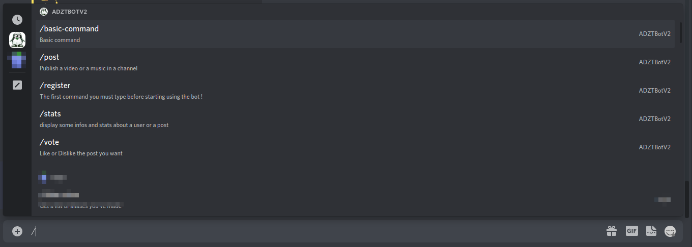

# ADZTBotV2

[](https://github.com/DarkOnion0/ADZTBotV2/actions/workflows/go.yml) [](https://github.com/DarkOnion0/ADZTBotV2/actions/workflows/container.yml) [](https://shields.io/github/v/release/DarkOnion0/ADZTBotV2?display_name=tag&include_prereleases&label=%F0%9F%93%A6%20Latest%20release)

> A little discord bot with a small footprint and easy to use to share music and video with your friends on your discord server

ADZTBotV2 is the successor of [ADZTBot](https://github.com/DarkOnion0/ADZTBot). It has been rewritten in go to make it
much faster, easier to deploy, easier to maintain...

## 🚀 Key Features

- Share music or video with your friends and vote for the post you like
- Support [Slash Commands](https://support.discord.com/hc/en-us/articles/1500000368501-Slash-Commands-FAQ)

## 📖 Usage

To use the bot you just need to type `/` in the message box in discord and the bot command auto-completion will start,
pretty easy right ?!



## 💾 Installation

### 🐹 Go Binary

1. Download the binary from the release page
2. Execute the command with the following flags (this flags can be get running the executable with the `-help` flag)

   ```sh
   -chanm #Discord channel id where the post of the music category will be sent to

   -chanv #Discord channel id where the post of the video category will be sent to

   -db #The mongodb database name

   -token #Bot access token

   -url #The mongodb access url
   
   -admin #The bot administrator discord role ID
   
   -debug #Sets log level to debug

   ```

3. And that's it

### 📦 Container (Docker, Podman...)

#### 1. 💾 Installation

There is 2 way to install `ADZTBotV2` using container

1. **Downloading It,**
   You can download the prebuilt container with the container manager you want,
   currently [only linux container are built](#-supported-container-platform), for more information
   see [the package page](https://github.com/DarkOnion0/ADZTBotV2/pkgs/container/adztbotv2)

   ```sh
   podman pull ghcr.io/darkonion0/adztbotv2:THE_VERSION_YOU_WANT
   ```

   > **⚠️ The `latest` tag follow the master branch so it may be unstable or just not-working, USE IT AT YOUR OWNN RISKS⚠️**

2. **Building it,**

   You can build `ADZTBotV2` using any OCI container builder you want that support Dockerfile. The official and
   currently only supported methods is [Buildah](https://github.com/containers/buildah) but you can also build it with
   Docker.

   To build `ADZTBotV2` using buildah execute the following command

   ```shell
    buildah bud -t adztbotv2-local .
   ```

#### 2. ✨ Running

Execute the following command and replace the env variables value by your own (you can also run the container with
docker by the way)

```sh
podman run -dt -e DB=$db -e URL=$url -e CHANM=$chanm -e CHANV=$chanv -e TOKEN=$token -e ADMIN=$admin -e DEBUG=$debug adztbotv2 ghcr.io/darkonion0/adztbotv2:latest
```

#### 🌉 Supported Container Platform

- `linux/amd64`
- `linux/386`
- `linux/arm64`
- `linux/arm`
- **_✨ More coming soon...✨_**
